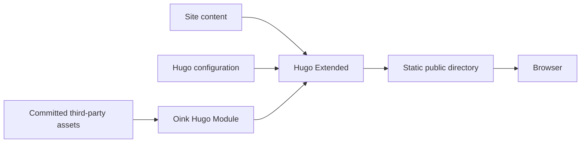
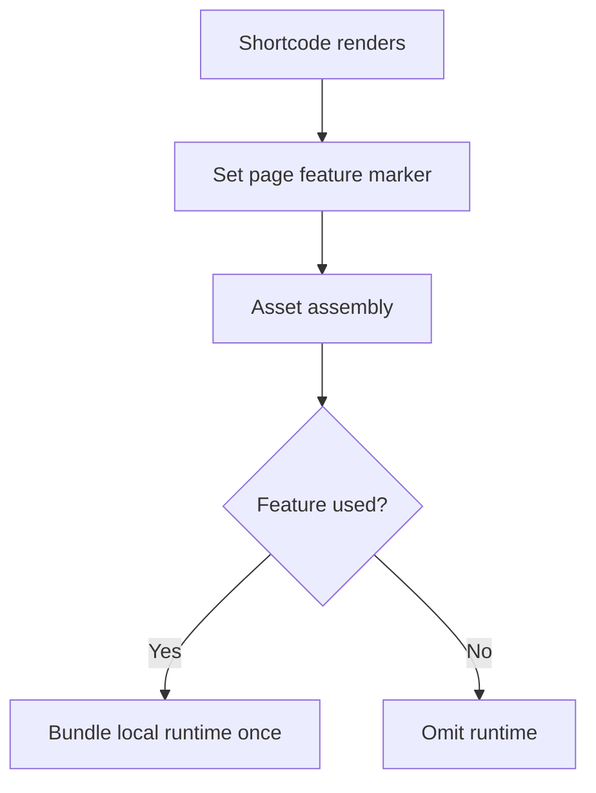

Oink is a direct Hugo theme, not an application server or a runtime wrapper
around Docsy. Hugo resolves content, configuration, layouts, and assets at build
time, then emits a static site for any ordinary file host.

## System boundary

The consumer boundary starts with a site plus the resolved theme module and ends
with Hugo's static output. No JavaScript package manager, CSS postprocessor
executable, or remote asset download is required in that path.

JavaScript still runs in the browser for interactive features. "Hugo-only"
describes the build dependency, not a JavaScript-free user interface.

## Repository boundary

### Theme repository

`github.com/pgsty/oink` is the published Hugo Module. Its root contains the
canonical layouts, partials, shortcodes, SCSS, JavaScript, fonts, icons, browser
runtimes, translations, `go.mod`, and `hugo.yaml`. `VENDOR.json` records the
bundled third-party assets.

The repository contains no project website or npm workspace. Root metadata such
as `README.md`, `LICENSE`, `NOTICE`, `theme.toml`, and the vendor manifest is
part of distributing and attributing the theme.

### Project site repository

`github.com/pgsty/oink.pgsty.com` contains the documentation, bilingual
examples, regression pages, site-specific layouts and assets, npm-based site
tests, and deployment configuration. It imports the public theme module in
`hugo.yaml` and pins its version in `go.mod`.

For local cross-repository development, an ignored `go.work` substitutes a
sibling theme checkout. No relative filesystem replacement is committed to the
site module.

## Build pipeline

Hugo combines four classes of input:

1. page bundles and Markdown content from the consuming site;
2. native Hugo configuration and supported theme parameters;
3. theme templates, translations, SCSS, and JavaScript;
4. committed static or Hugo Asset resources.

Hugo compiles SCSS with its embedded pipeline, bundles page JavaScript, minifies
production resources, fingerprints eligible outputs, and rewrites relative URLs
for the configured `baseURL`. Oink does not invoke Hugo's `postCSS` pipe.

The final `public/` directory contains HTML, CSS, JavaScript, fonts, search
indexes, feeds, sitemaps, and copied static files. It can be deployed without
the source tree.

## Page shell

The canonical page shell is assembled from small partials:

- a global navbar and responsive sub-navigation;
- language and color-mode controls;
- a resizable, foldable documentation sidebar;
- breadcrumbs, table of contents, reading metadata, feedback, and repository
  links where configured;
- a shared footer and print layouts.

Normal Hugo lookup remains available for site-specific extensions. Override the
narrowest partial possible instead of copying `baseof.html` or the entire shell.

## Conditional runtime loading

Content shortcodes record feature use in the page store. Asset partials inspect
those markers and include the corresponding local runtime at most once:

This keeps a plain article free of ECharts, Asciinema, or Infographic code while
allowing multiple component instances on a feature page.

## Multilingual routing

Oink delegates language identity to Hugo. The selector uses each page's
`.Translations` and the site's configured languages, ordered by weight. Missing
translations fall back to the target-language home page. The same data drives
canonical and alternate metadata.

## Security boundaries

Oink keeps authored data and authored executable code explicit:

- structured ECharts options are parsed as JSON or YAML and safely serialized;
- optional ECharts JavaScript blocks register callbacks only on pages that
  declare them;
- component identifiers and configuration are generated by templates rather than
  unescaped HTML strings;
- hosted search, analytics, comments, remote media, and service endpoints remain
  explicit site decisions.

Goldmark's `unsafe` setting permits trusted project authors to use inline HTML;
it is not a sanitizer for untrusted submissions.

## Upstream maintenance

Oink preserves Docsy's source history and Apache-2.0 obligations. Upstream
changes are classified as applicable, superseded by an intentional Oink
difference, or unrelated. Applicable changes are ported into the canonical
implementation without recreating an upstream-versus-brand runtime switch.

## Extension boundary

Put an implementation in the theme when it is broadly reusable, has a stable
content API, and can own its assets and accessibility behavior. Keep it in the
site when it embeds product data, pricing, catalog assumptions, or a one-off
landing-page structure.
