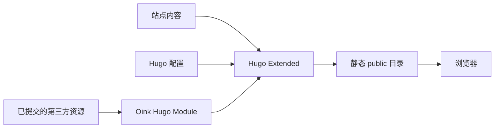
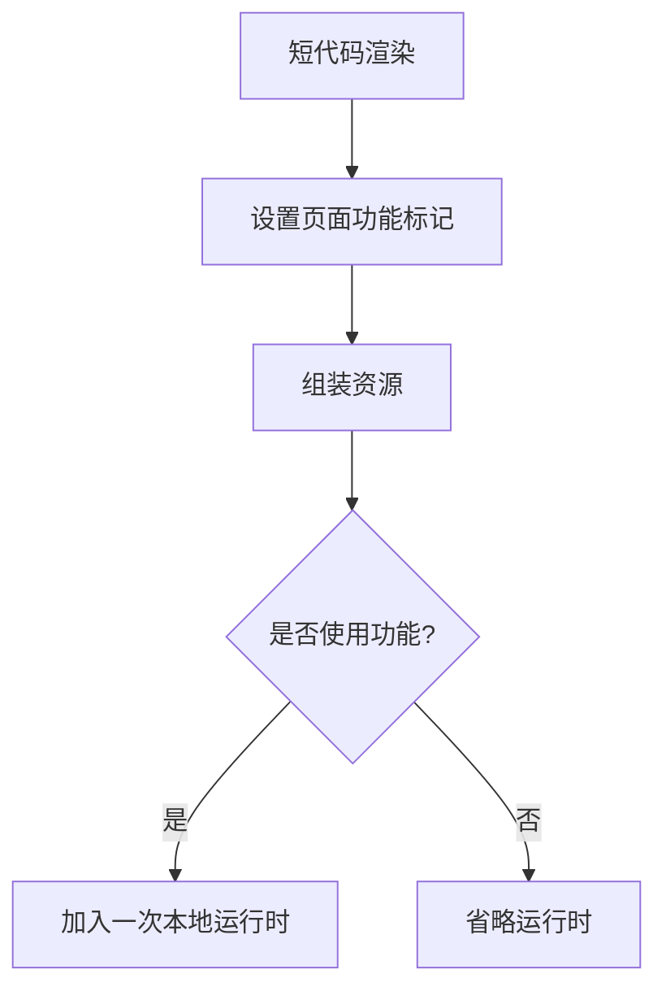

Oink 是一款直接运行于 Hugo 的主题，而不是应用服务器，也不是套在 Docsy 外面的运行时包装层。Hugo 在构建阶段解析内容、配置、布局与资源，再生成可由普通文件托管服务发布的静态站点。

## 系统边界 {#system-boundary}

消费端边界始于站点与已经解析的主题模块，止于 Hugo 生成的静态文件。在这条路径中，不需要 JavaScript 包管理器、CSS 后处理器可执行文件或远程资源下载。

交互功能仍会在浏览器中运行 JavaScript。“仅依赖 Hugo”描述的是构建依赖，并不意味着用户界面完全没有 JavaScript。

## 仓库边界 {#repository-boundary}

### 主题仓库 {#theme-repository}

`github.com/pgsty/oink` 是公开 Hugo
Module。仓库根目录包含标准布局、partial、短代码、SCSS、JavaScript、字体、图标、浏览器运行时、翻译资源、`go.mod`
与 `hugo.yaml`。`VENDOR.json` 记录随附的第三方资源。

该仓库不包含项目网站或 npm
workspace。`README.md`、`LICENSE`、`NOTICE`、`theme.toml`
与 vendor 清单等根元数据，是发布和标注主题来源所必需的内容。

### 项目站点仓库 {#project-site-repository}

`github.com/pgsty/oink.pgsty.com`
包含文档、双语示例、回归页面、站点专用布局与资源、基于 npm 的站点测试，以及部署配置。它在
`hugo.yaml` 中导入公开主题模块，并在 `go.mod` 中固定版本。

跨仓库本地开发时，被忽略的 `go.work`
会替换为同级主题 checkout；站点模块不会提交相对文件系统 replacement。

## 构建流水线 {#build-pipeline}

Hugo 会合并四类输入：

1. 消费站点的页面 bundle 与 Markdown 内容；
2. Hugo 原生配置和受支持的主题参数；
3. 主题模板、翻译、SCSS 与 JavaScript；
4. 已提交的 static 或 Hugo Asset 资源。

Hugo 使用内置流水线编译 SCSS、打包页面 JavaScript、压缩生产资源、为适用产物生成指纹，并按照配置的
`baseURL` 重写相对 URL。Oink 不调用 Hugo 的 `postCSS` pipe。

最终 `public/`
目录包含 HTML、CSS、JavaScript、字体、搜索索引、feed、sitemap 与复制的静态文件；部署时不需要源码树。

## 页面外壳 {#page-shell}

标准页面外壳由小型 partial 组装：

- 全局 navbar 与响应式次级导航；
- 语言和颜色模式控件；
- 可调整宽度、可折叠的文档侧栏；
- 面包屑、目录、阅读元数据、反馈与仓库链接；
- 公共页脚与打印布局。

Hugo 的正常模板查找机制仍可用于站点扩展。应覆盖最小范围的 partial，而不是复制
`baseof.html` 或整个外壳。

## 条件运行时加载 {#conditional-runtime-loading}

内容短代码会在 page
store 中记录功能使用情况。资源 partial 检查这些标记，并且最多加入一次对应本地运行时：

因此普通文章不会加载 ECharts、Asciinema 或 Infographic，同时功能页仍可包含多个组件实例。

## 多语言路由 {#multilingual-routing}

Oink 把语言身份交给 Hugo 管理。选择器使用每页的 `.Translations`
与按权重排序的站点语言。缺少译文时回退到目标语言首页；同一组数据也用于 canonical 与 alternate 元数据。

## 安全边界 {#security-boundaries}

Oink 让作者数据与作者提供的可执行代码保持显式：

- 结构化 ECharts 选项按 JSON 或 YAML 解析并安全序列化；
- 可选的 ECharts JavaScript 块只在声明它们的页面注册回调；
- 组件 ID 与配置由模板生成，不通过未转义 HTML 字符串拼装；
- 托管搜索、分析、评论、远程媒体与服务端点始终由站点显式决定。

Goldmark 的 `unsafe`
设置允许受信任的项目作者使用行内 HTML；它不是针对不受信任输入的净化器。

## 上游维护 {#upstream-maintenance}

Oink 保留 Docsy 的源码历史与 Apache-2.0 义务。上游变更会被分类为适用、已被 Oink 有意差异取代，或无关。适用变更会移植到标准实现中，而不会重新制造上游与品牌两套运行模式。

## 扩展边界 {#extension-boundary}

一项实现如果广泛可复用、具有稳定内容 API，并能自行管理资源与无障碍行为，就应放入主题；如果它嵌入产品数据、价格、目录假设或一次性落地页结构，则应保留在站点中。
