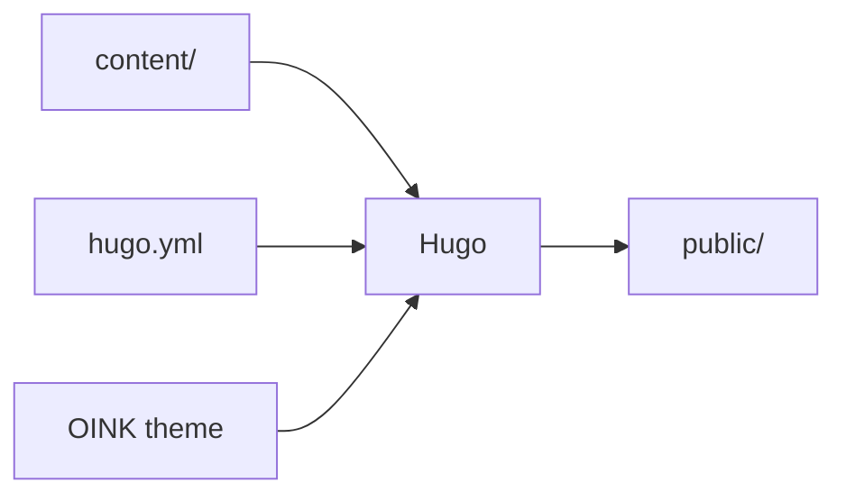
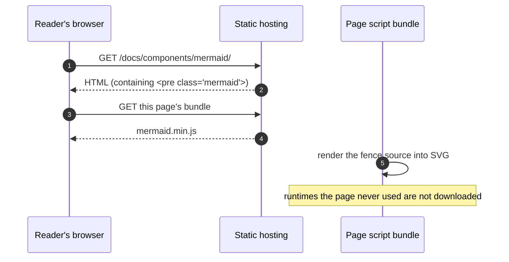
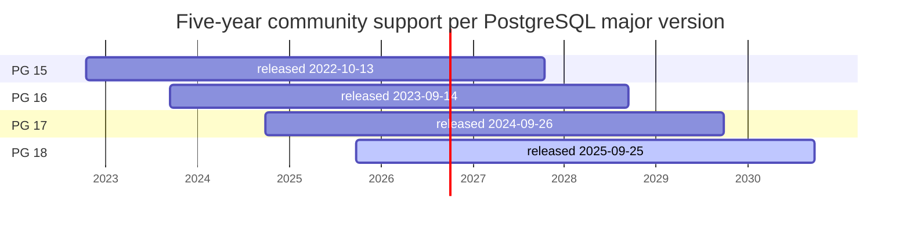
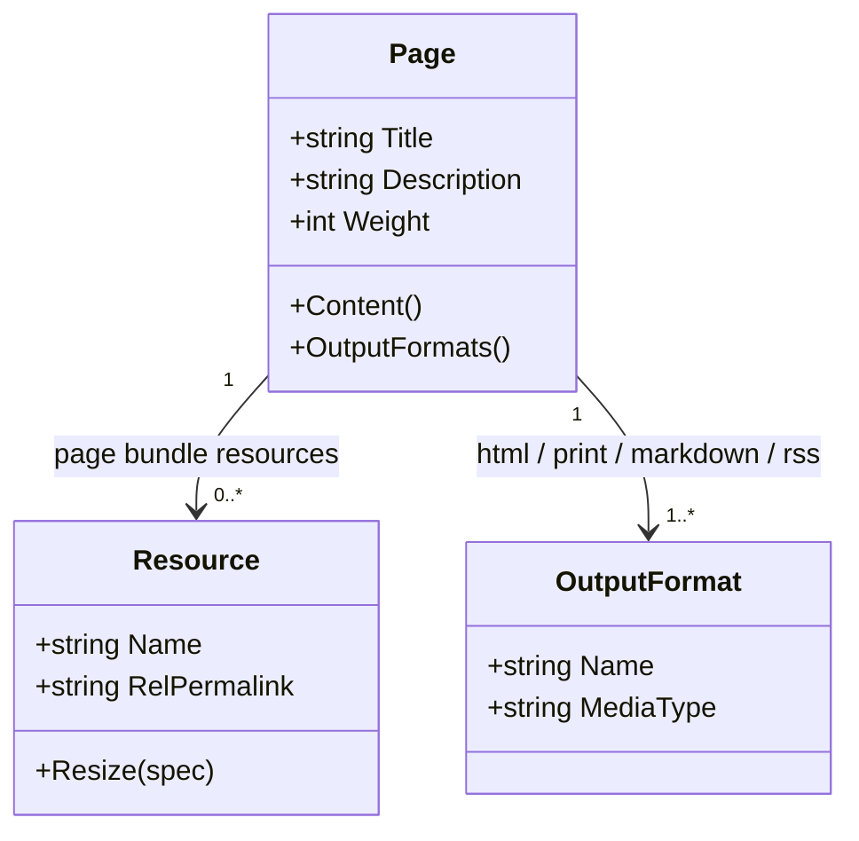
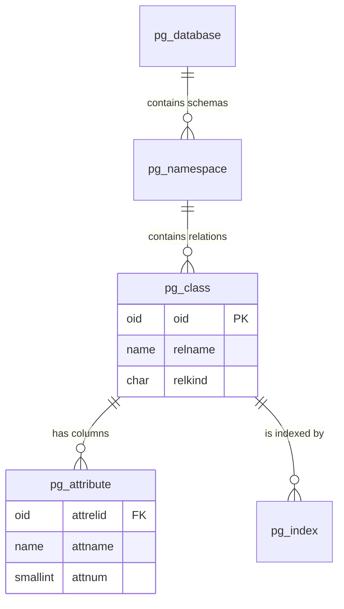
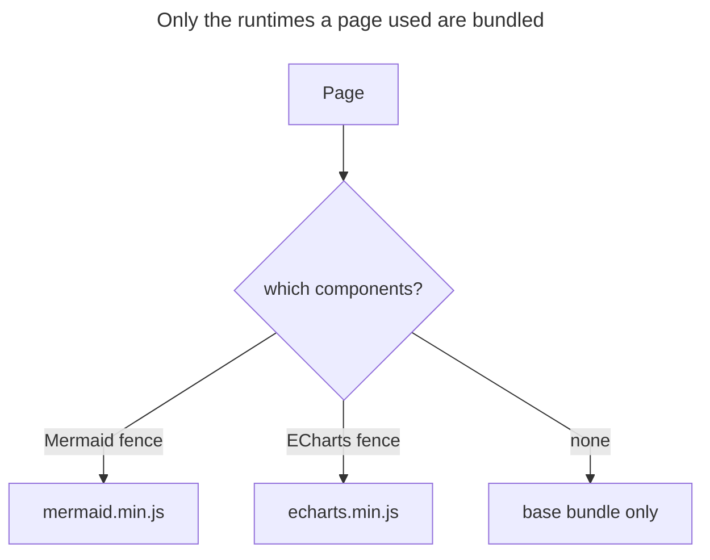
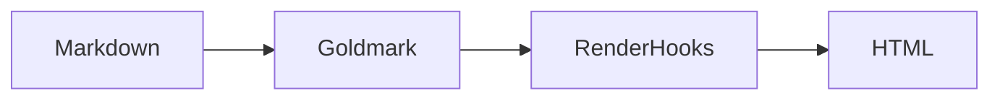
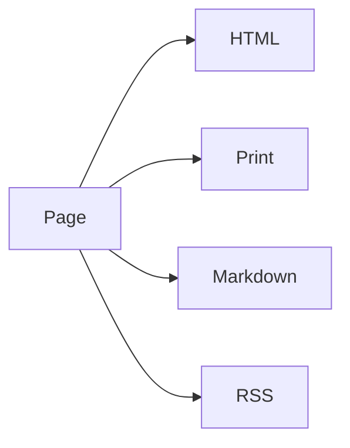

A `mermaid` fence renders text as a flowchart, sequence diagram, Gantt chart,
class diagram, ER diagram or state diagram. The diagram exists as source: it goes
into Git, it reviews as a diff, and search finds it. Rendering happens in the
reader's browser with the Mermaid copy the theme ships — no external service is
contacted. Diagrams that need pixel-level control belong in an SVG, used as an
[image](/docs/components/image/).

## Shortest form {#minimal}

````markdown {title="Source"}

````


The fence language is `mermaid` and there is no other switch. Only when the
theme sees such a fence does it add the Mermaid runtime to that page, and ten
diagrams on one page still load it once.

## Sequence diagrams {#sequence}

`sequenceDiagram` describes messages between participants over time, which suits
request paths and load order.

````markdown {title="Source"}

````


## Gantt charts {#gantt}

`gantt` draws intervals. Below is the five-year community support window of each
PostgreSQL major version, counted from its release date; `1825d` is five years.

````markdown {title="Source"}

````


## Class and ER diagrams {#class-and-er}

`classDiagram` draws types and relationships, `erDiagram` entities and
cardinality. Both are common ways to explain a data model.

````markdown {title="Source"}

````


````markdown {title="Source"}

````


## State diagrams {#state}

`stateDiagram-v2` draws states and the conditions between them. Below are the
five states an OINK release passes through. They are not interchangeable, and a
green local build is none of them.

````markdown {title="Source"}

````


```mermaid
stateDiagram-v2
  [*] --> SourceComplete
  SourceComplete --> Validated : theme checks + site suite green
  Validated --> Published : an immutable signed vX.Y.Z tag is pushed
  Published --> Documented : the site's go.mod pins that tag
  Documented --> Deployed : the production build goes live
  Deployed --> [*]
  Published --> SourceComplete : a problem means a new patch version; tags never move
```

## Per-diagram title and configuration {#per-diagram-config}

The top of a fence body may carry Mermaid's own YAML header — this is not Hugo
front matter. `title` gives the diagram a title and `config` overrides Mermaid
configuration for this diagram alone. A diagram that hard-codes `config.theme`
no longer follows the site's colour scheme.

````markdown {title="Source"}

````


## Light and dark {#dark-mode}

The theme reads the current colour scheme when the page initializes: in dark
mode it uses Mermaid's `dark` theme, in light mode the theme the site
configured. Mermaid cannot be re-initialized, so switching the colour scheme
**reloads the whole page** and the diagrams come back in the new colours.

For that reason, keep Mermaid diagrams off pages that must preserve input
state — a page with a form, for instance.

Site-wide defaults go in `hugo.yml` with lowercase keys; the theme matches them
back to Mermaid's own casing:

```yaml {title="hugo.yml"}
params:
  mermaid:
    theme: neutral
    flowchart:
      diagrampadding: 6
```

The full key table is in
[Configuration](/docs/customize/config/); for accepted
values see the
[Mermaid configuration reference](https://mermaid.js.org/config/schema-docs/config.html).

## Inside tabs and steps {#compose}

A `mermaid` fence has no `tab` attribute — adjacent-fence tabs apply to ordinary
code fences only. To compare two diagrams side by side, use the `tabs`
shortcode.

````markdown {title="Source"}








````










Each step inside `{}` is page-level Markdown and can hold a
`mermaid` fence; see [Steps](/docs/components/steps/).

## Output {#outputs}

| Output | Shape |
| --- | --- |
| HTML | `<pre class="mermaid">` plus the local Mermaid runtime; the browser draws the SVG |
| Print | Same as HTML: the print view loads the runtime too, so the diagrams are drawn |
| Markdown | The `mermaid` fence and its source, kept as written |
| RSS | The diagram source inside `<pre class="mermaid">` — subscribers see text |

## Parameter reference {#reference}

Fence attributes: none. A `mermaid` fence reads no attribute line; writing
`{height=…}` or `{class=…}` neither works nor errors. Size follows the diagram
itself and the container width.

Site parameters (`hugo.yml`):

| Parameter | Type | Default | Description |
| --- | --- | --- | --- |
| `params.mermaid` | map | unset | The whole map is passed to Mermaid's `initialize()`; write keys in lowercase and the theme matches them back to Mermaid's casing |
| `params.mermaid.theme` | string | Mermaid's default | The light-mode theme; dark mode forces `dark` |
{.fields meta="type default"}

Per-diagram configuration goes in the YAML header at the top of the fence body
(`title`, `config`). That is Mermaid syntax, not a theme parameter.

## Limits {#limits}

- Switching colour scheme reloads the page: Mermaid cannot be re-initialized,
  and the theme chose correct rendering over avoiding the reload.
- Diagrams cannot be numbered or zoomed: Mermaid emits inline SVG, not an
  ``, so `{#id num=}` numbering and image zoom do not apply. Export to an
  image when you need a number and use the [image](/docs/components/image/)
  numbering.
- Fence attributes do nothing: control width inside the diagram (flowchart
  direction, class-diagram layout) or with CSS.
- Syntax errors show up only in the browser: Hugo does not parse Mermaid, so a
  broken diagram renders Mermaid's error box while the build still passes. Check
  in a browser before publishing.
- RSS subscribers see the source only: put the conclusion in the prose, not only
  in the picture.

## Related {#related}

- [PlantUML](/docs/components/plantuml/) — more complete UML, at the price of a rendering server
- [Markmap](/docs/components/markmap/) — outline-shaped hierarchies
- [ECharts](/docs/components/echarts/) — charts with numbers in them
- [Images](/docs/components/image/) — hand-drawn SVG, numbering and zoom
