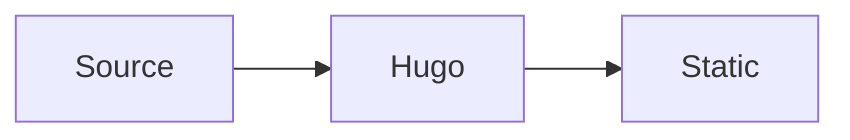

OINK supports KaTeX, Mermaid, Markmap, PlantUML, and Diagrams.net. KaTeX,
Mermaid, and Markmap use build-time or same-origin resources shipped with the
theme. PlantUML and the Diagrams.net editor require an explicitly configured
service endpoint; they do not silently default to a public service.

## LaTeX support with KaTeX

[KaTeX][] renders TeX mathematics for the web. Hugo's embedded KaTeX support can
render formulae at build time, so readers do not need a remote math service.

### Inline formulae

Inline formulae use the passthrough delimiter pairs configured in Goldmark. Keep
surrounding spaces and punctuation outside the formula when possible.

### Formulae in display mode

Use a `math` code block for a formula on its own line:

````markdown
```math
E = mc^2
```
````

```math
E = mc^2
```

### Activating KaTeX support

`math` and `chem` code blocks use theme render hooks automatically. For inline
and delimiter-based formulae, enable Goldmark's `passthrough` extension and set
the delimiter pairs appropriate for the site. The included `oink.pgsty.com`
config shows square-bracket, double-dollar, and parenthesis pairs.

#### Enable the `passthrough` extension

The relevant YAML structure is:

```yaml
markup:
  goldmark:
    extensions:
      passthrough:
        enable: true
        delimiters:
          block: []
          inline: []
```

Fill the arrays with Hugo's documented delimiter pairs. Choose pairs that do not
conflict with the site's prose or code and apply the setting consistently in
every build environment.

#### Add the `passthrough` render hook

For delimiter-based math, create `layouts/_markup/render-passthrough.html` in
the site:

```go-html-template
{{ partial "scripts/math.html" . }}
```

The hook can be scoped to a content type or section by placing it under the
corresponding layout directory. A scoped hook avoids treating unrelated content
as mathematical passthrough.

### Chemical equations and physical units

Hugo's embedded KaTeX supports the `mhchem` extension. Use `chem` code blocks
for chemical equations. The same extension supports physical units. See the
[mhchem manual][] for its equation and unit syntax.

## Diagrams with Mermaid

[Mermaid][] turns a text definition into a diagram in the browser. Use a
`mermaid` code block:

````markdown

````


The theme detects the block, publishes its pinned local Mermaid runtime, and
loads it once on that page. Pages without Mermaid do not load the runtime.

Site-wide Mermaid settings live under `params.mermaid`:

```yaml
params:
  mermaid:
    theme: neutral
    flowchart:
      diagramPadding: 6
```

Per-diagram front matter can override supported Mermaid settings. Keep diagram
text readable in source, test both color modes, and provide surrounding prose
for information that must remain accessible when a diagram cannot render.

## UML diagrams with PlantUML

[PlantUML][] supports sequence, use-case, class, state, and other UML-oriented
diagrams. A `plantuml` block contains the source:

````markdown
```plantuml
actor Reader
participant Browser
participant "PlantUML endpoint" as Server
Reader -> Browser: Open page
Browser -> Server: Request encoded diagram
Server --> Browser: SVG
```
````

PlantUML requires a renderer endpoint. Enable it only with an approved local or
explicit remote service:

```yaml
params:
  plantuml:
    enable: true
    theme: default
    svg_image_url: https://plantuml.internal.example/plantuml/svg/
    svg: false
```

The endpoint receives encoded diagram source from the browser. Review its
confidentiality, availability, CSP, and offline implications. For an air-gapped
site, use an internal endpoint or commit pre-rendered images; do not point the
default configuration at a public demo server.

## Mind-map support with Markmap

[Markmap][] converts a Markdown outline into an interactive mind map:

````markdown
```markmap
# Local-first
## Build
- Hugo Extended
## Browser
- Local scripts
- Local fonts
```
````

```markmap
# Local-first
## Build
- Hugo Extended
## Browser
- Local scripts
- Local fonts
```

Enable the feature globally when desired:

```yaml
params:
  markmap:
    enable: true
```

The runtime is pinned and served locally. Keep the underlying outline useful and
avoid relying on pointer-only interactions.

## Diagrams with Diagrams.net

[Diagrams.net][] (`draw.io`) can export SVG and PNG files that retain an
embedded copy of their editable diagram. OINK can detect those images and show
an **Edit** action when an editor endpoint is explicitly configured.

```yaml
params:
  drawio:
    enable: true
    drawio_server: https://drawio.internal.example/
```

Export with **Include a copy of my diagram** enabled. The page can display the
exported image offline, but opening the editor requires the configured service.
Saving in the editor downloads an updated file to the browser; it does not write
directly to the documentation repository.

Treat a public Diagrams.net endpoint as an online integration. If editing must
stay inside an organization, deploy an approved [self-hosted editor][] and set
`drawio_server` to it.

## Resource and authoring checklist

- Use text-based diagrams when reviewable diffs are valuable.
- Provide alt text or adjacent prose for essential meaning.
- Test light, dark, mobile, print, and reduced-motion behavior.
- Keep local runtimes pinned in `VENDOR.json` and load them only when used.
- Never include secrets in diagram source sent to a service endpoint.
- Use pre-rendered output when an online renderer is unacceptable.
- Verify all asset and endpoint URLs under a subpath `baseURL`.

[Diagrams.net]: https://www.diagrams.net/
[KaTeX]: https://katex.org/
[Markmap]: https://markmap.js.org/
[Mermaid]: https://mermaid.js.org/
[mhchem manual]: https://mhchem.github.io/MathJax-mhchem/
[PlantUML]: https://plantuml.com/
[self-hosted editor]: https://github.com/jgraph/docker-drawio
