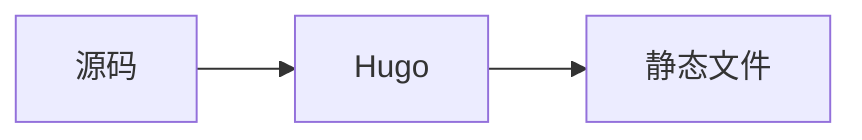

OINK 支持 KaTeX、Mermaid、Markmap、PlantUML 和 Diagrams.net。KaTeX、Mermaid 与 Markmap 使用构建期能力或主题随附的同源资源。PlantUML 和 Diagrams.net 编辑器需要显式配置服务端点；主题不会静默使用公共服务。

## 使用 KaTeX 支持 LaTeX {#latex-support-with-katex}

[KaTeX][]
可以在 Web 上渲染 TeX 数学公式。Hugo 内置的 KaTeX 支持可以在构建期间渲染公式，因此读者不需要连接远程数学服务。

### 行内公式 {#inline-formulae}

行内公式使用 Goldmark 中配置的 passthrough 分隔符。条件允许时，应把公式前后的空格与标点留在公式之外。

### 独立显示公式 {#formulae-in-display-mode}

使用 `math` 代码块独立显示公式：

````markdown
```math
E = mc^2
```
````

```math
E = mc^2
```

### 启用 KaTeX 支持 {#activating-katex-support}

`math` 与 `chem`
代码块会自动使用主题渲染钩子。对于行内公式和使用分隔符的公式，请启用 Goldmark 的
`passthrough` 扩展，并设置适合站点的分隔符。随仓库提供的 `oink.pgsty.com`
配置展示了方括号、双美元符号和圆括号分隔符。

#### 启用 `passthrough` 扩展 {#enable-the-passthrough-extension}

相关 YAML 结构如下：

```yaml
markup:
  goldmark:
    extensions:
      passthrough:
        enable: true
        delimiters:
          block: []
          inline: []
```

请根据 Hugo 文档填写分隔符数组。所选分隔符不能与站点正文或代码冲突，并且必须在所有构建环境中保持一致。

#### 添加 `passthrough` 渲染钩子 {#add-the-passthrough-render-hook}

对于使用分隔符的数学公式，请在站点中创建
`layouts/_markup/render-passthrough.html`：

```go-html-template
{{ partial "scripts/math.html" . }}
```

也可以把钩子放在对应布局目录下，将其限制到某种内容类型或某个分区。限制作用域可以避免把无关内容当作数学 passthrough 处理。

### 化学方程式与物理单位 {#chemical-equations-and-physical-units}

Hugo 内置 KaTeX 支持 `mhchem` 扩展。化学方程式可以使用 `chem`
代码块；同一扩展也支持物理单位。方程式与单位语法请参阅 [mhchem 手册][]。

## 使用 Mermaid 绘图 {#diagrams-with-mermaid}

[Mermaid][] 可以在浏览器中把文本定义转换为图表。使用 `mermaid` 代码块：

````markdown

````


主题会检测代码块、发布固定版本的本地 Mermaid 运行时，并且在该页只加载一次。不使用 Mermaid 的页面不会加载运行时。

站点级 Mermaid 设置位于 `params.mermaid`：

```yaml
params:
  mermaid:
    theme: neutral
    flowchart:
      diagramPadding: 6
```

每幅图也可以通过 Mermaid 支持的 front
matter 覆盖设置。图表源码应保持可读，并同时测试深浅色模式。对于图表无法渲染时仍必须传达的信息，请提供相邻正文。

## 使用 PlantUML 绘制 UML 图 {#uml-diagrams-with-plantuml}

[PlantUML][] 支持时序图、用例图、类图、状态图和其他面向 UML 的图表。`plantuml`
代码块包含图表源码：

````markdown
```plantuml
actor Reader
participant Browser
participant "PlantUML endpoint" as Server
Reader -> Browser: Open page
Browser -> Server: Request encoded diagram
Server --> Browser: SVG
```
````

PlantUML 需要渲染端点。只有在配置了获准使用的本地或显式远程服务后才应启用：

```yaml
params:
  plantuml:
    enable: true
    theme: default
    svg_image_url: https://plantuml.internal.example/plantuml/svg/
    svg: false
```

浏览器会把编码后的图表源码发送给端点。请评审其保密性、可用性、CSP 与离线影响。网络隔离站点应使用内部端点或提交预渲染图片，默认配置不能指向公共演示服务器。

## 使用 Markmap 支持思维导图 {#mind-map-support-with-markmap}

[Markmap][] 可以把 Markdown 大纲转换为交互式思维导图：

````markdown
```markmap
# 本地优先
## 构建
- Hugo Extended
## 浏览器
- 本地脚本
- 本地字体
```
````

```markmap
# 本地优先
## 构建
- Hugo Extended
## 浏览器
- 本地脚本
- 本地字体
```

需要时可以全局启用：

```yaml
params:
  markmap:
    enable: true
```

运行时采用固定版本并从本地提供。底层大纲本身也应有用，同时不要依赖只能通过指针完成的交互。

## 使用 Diagrams.net 绘图 {#diagrams-with-diagramsnet}

[Diagrams.net][]（`draw.io`）可以导出包含可编辑图表副本的 SVG 与 PNG。显式配置编辑器端点后，OINK 可以检测这些图片并显示
**编辑** 操作。

```yaml
params:
  drawio:
    enable: true
    drawio_server: https://drawio.internal.example/
```

导出时请启用 **Include a copy of my
diagram**。页面可以离线显示导出图片，但打开编辑器需要连接配置的服务。编辑器保存时会把更新后的文件下载到浏览器，不会直接写入文档仓库。

公共 Diagrams.net 端点属于在线集成。如果编辑过程必须留在组织内部，请部署获准使用的[自托管编辑器][]，并让
`drawio_server` 指向它。

## 资源与创作检查清单 {#resource-and-authoring-checklist}

- 当可评审 diff 很重要时，优先使用文本图表。
- 为关键信息提供替代文字或相邻正文。
- 测试深浅色、移动端、打印和减少动态效果模式。
- 在 `theme/VENDOR.json` 中固定本地运行时，并且只在使用时加载。
- 绝不能把机密写入会发送给服务端点的图表源码。
- 无法接受在线渲染器时，使用预渲染输出。
- 在子路径 `baseURL` 下验证所有资源与端点 URL。

[Diagrams.net]: https://www.diagrams.net/
[KaTeX]: https://katex.org/
[Markmap]: https://markmap.js.org/
[Mermaid]: https://mermaid.js.org/
[mhchem 手册]: https://mhchem.github.io/MathJax-mhchem/
[PlantUML]: https://plantuml.com/
[自托管编辑器]: https://github.com/jgraph/docker-drawio
